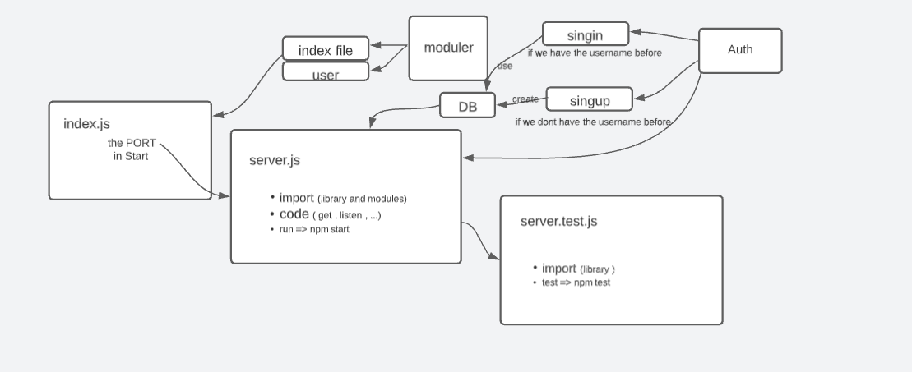
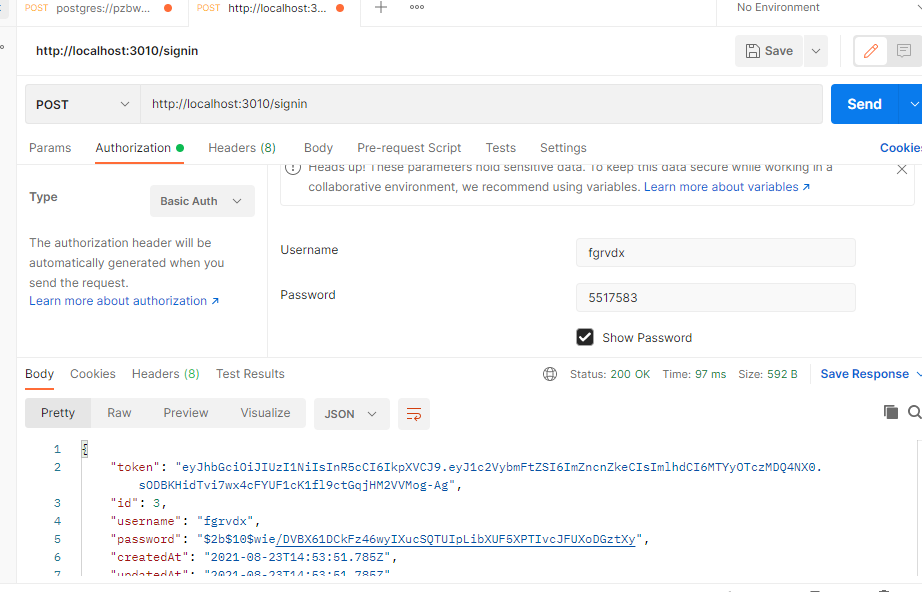
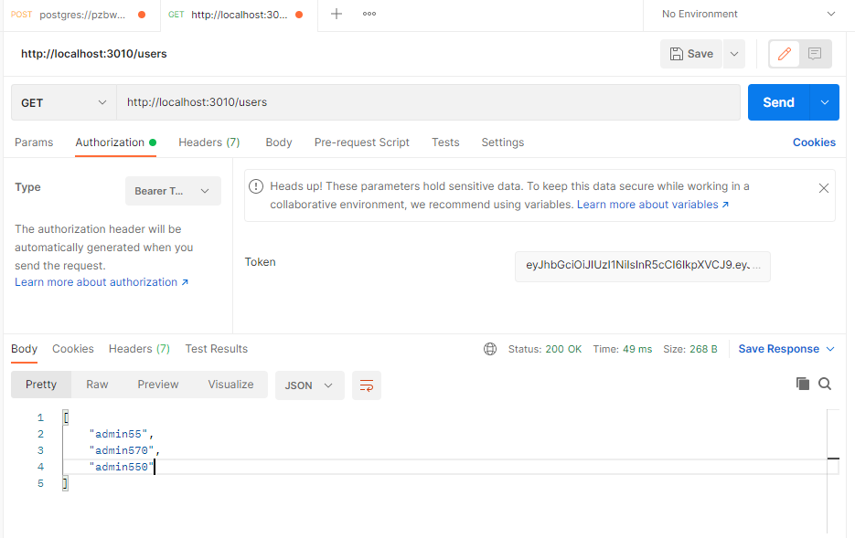

# bearer-auth (lab07)

[github-lab07]()

- run the code by using npm start || nodemon
- test the code by using npm test || on the github

> finish time : 6:25 pm

## running the functionality

- signup
  
- signin
  
- users
  
- DB-TABLE
  
